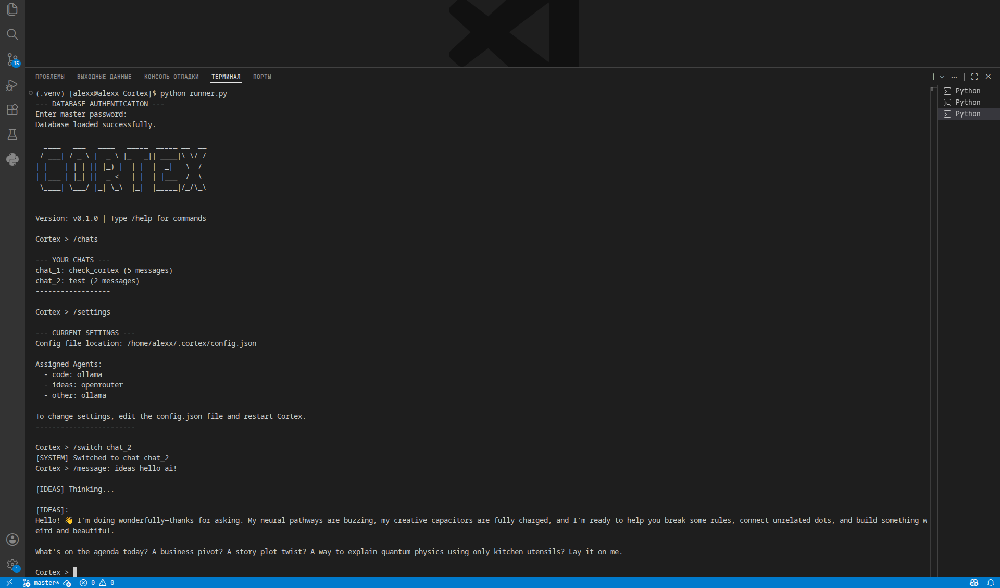

<div align="center">

# **Cortex**
Secure Multi-Agent AI Framework

[](https://github.com/Alexx-coder/Cortex.git)
[](https://opensource.org/licenses/MIT)
[](https://www.python.org/downloads/)
[](https://cryptography.io/en/latest/fernet/)

[](https://ollama.com/)
[](https://gemini.google.com/)
[](https://openai.com/)
[](https://openrouter.ai/)


---

<div align="left">

## **About Cortex**

- Cortex is a powerful CLI tool that splits AI tasks into specialized agents. Instead of using one model for everything, you assign specific roles: one agent for writing code, another for brainstorming ideas, and
a third for general tasks.

- Privacy First: Your chat history is securely encrypted locally using military-grade AES-256 cryptography. No one can read your data without your master password.


## **Features**

- 🤖 Multi-Agent System: Assign different providers (Ollama, Gemini, OpenAI, OpenRouter) to different tasks.

- 🔒 Encrypted History: All chats are saved in an AES-256 encrypted database.

- 🦙 Full Ollama Support: Run everything 100% locally using models like glm-4.7-flash.

- ☁️ Cloud Providers: Seamlessly integrate Google Gemini, OpenAI, and OpenRouter (including free models).

- ⚙️ JSON Configuration: Easy setup via a simple config.json file.

- 🖥️ Clean CLI Interface: Beautiful terminal UI powered by art.

## **Screenshots**

<div align="center">


- Cortex is working in terminal

<div align="left">

## **Install Cortex**

1. Clone the repository Cortex 

```bash
git clone https://github.com/Alexx-coder/Cortex.git
cd Cortex
``` 

2. Create a virtual environment

```bash
python -m venv .venv
source .venv/bin/activate
```

3. Install dependencies:

```bash
pip install -r requirements.txt
```

4. Run Cortex:

```bash
python runner.py
```

## **Configuration**

- All settings are managed in ~/.cortex/config.json.

1. Add your API keys (Gemini, OpenAI, OpenRouter). Leave blank if you want to use only local Ollama.

2. Change the Ollama model name to match your downloaded model (e.g., glm-4.7-flash:latest).

3. Assign providers to agents:

```json
"agents": {
    "code": "ollama",
    "ideas": "openrouter",
    "other": "ollama"
}
```

## **Usage and Commands**

- When you start Cortex, you will be asked for a Master Password to decrypt your chat database.

| Command | Description |
| :--- | :--- |
| `/new <name>` | Create a new encrypted chat session |
| `/chats` | List all saved chats |
| `/switch <id>` | Switch to another chat session |
| `/message: <agent> <text>` | Send a prompt to a specific agent (`code`, `ideas`, `other`) |
| `/export` | Save a chat to .md file |
| `/settings` | View current provider and agent configuration |
| `/help` | Show all commands |
| `/about` | Information about the project |
| `/stop` | Exit Cortex |

- Example:

```text
Cortex > /new Python Project
Cortex > /message: code write a fast fibonacci function
Cortex > /message: ideas how can I optimize this further?
```

## **Security**

- Cortex does not send your chat history to any third-party servers for storage. All history is encrypted using the `cryptography library's Fernet implementation`.

- Fernet provides authenticated encryption using AES-128 in CBC mode with PKCS7 padding and HMAC using SHA256 for integrity. This ensures that your chats cannot be read or tampered with without your master password. The database is saved locally in `~/.cortex/chats.db`.

- Note: If you lose your master password, you lose access to your chat history, as the encryption is cryptographically secure.

## **Contributing**

- Contributions, issues, and feature requests are welcome!
Feel free to check the [issues page](https://github.com/Alexx-coder/Cortex/issues)

## **License**

- This project is under the MIT License.


---

<div align="center">
Made with by <a href="https://github.com/Alexx-coder">Alexx-coder</a>
</div>